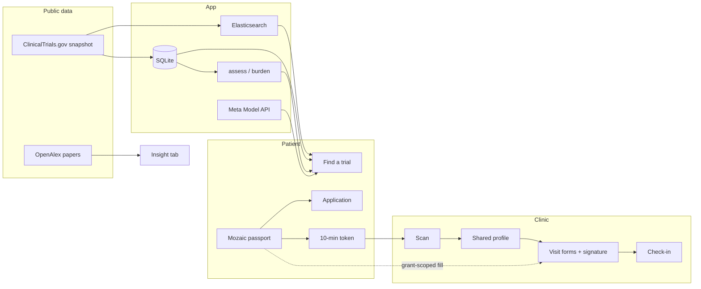

# Mozaic

Mozaic is a companion that makes clinical trials more friendly: patients keep a
passport of their health and logistics, find studies, apply, and follow one
approved path of visits and to-dos. Researchers scan that passport to open a
scoped profile, fill in-person visit forms, and check people in.

Mozaic does **not** decide eligibility. Only a study's investigators can do that.

**[Watch the 3-minute demo](https://youtu.be/mqtkLYHioBQ)** · **[Try the live app](https://hackmit-production-bf7d.up.railway.app/login)** · MIT licensed

---

## Problem

Finding a clinical trial is only part of the problem. Many people don't trust
trials, and the process is tedious and a lot of work. Even when a trial looks
relevant, people still wonder if they'd qualify, how much time and travel it
would take, and who they can ask. Paperwork is tedious and clinicians end up
repeating the same clarification work.

## Purpose

Give someone a **passport** of what they already know, then reuse it everywhere
a form would otherwise start from zero — applying, talking to a coordinator, and
signing packets at the visit — without ever claiming they are eligible.

On the clinic side, staff scan that passport, see only the grant the person
scoped, fill consent / screening / this-visit forms from it, collect a
signature, and cannot finish check-in until the required packets for that
appointment are on file.

---

## What you can do

**Patient**

- Search 300 real [ClinicalTrials.gov](https://clinicaltrials.gov) studies
- See *N of T requirements match*, check off criteria you confirm, and keep
  unknowns visible
- Tap the Mozaic passport to fill an application (Apple Pay–style)
- Follow one approved study path: waiting for approval → get ready → visits
- Show a ten-minute QR that carries **no health data**
- Collect postage-stamp records of studies you have completed
- Opt in to talk with someone weighing the same study

**Clinic / researcher**

- Inbox of applications, ordered by what was asked and how long it waited
- Scan the ticket or type the pass number
- Open only the sections they shared; revoke removes them
- Fill in-person packets from the passport, then a signature
- Check-in stays locked until that visit's required forms are saved

---

## Architecture

How a fact moves through the product:



1. Registry records are ingested into SQLite. Elasticsearch, when configured,
   holds the same public text for search. Nothing about a person is indexed.
2. Eligibility and visit-burden arithmetic are **rules**. Meta only rewrites
   source-grounded text, answers from the record, and explains peer overlaps.
3. Insight quotes review papers from OpenAlex. A paper cannot establish
   eligibility, so it stays on its own tab.
4. The passport is the source of truth the person controls. Apply and visit
   forms start empty; a tap fills only what that grant allowed.
5. The QR is a random token. The grant lives on the server, lasts ten minutes,
   and can be revoked. Unknown, expired, and revoked codes look the same.

```
data/snapshot/      300 ClinicalTrials.gov records
data/fixtures/      synthetic personas + one labelled fictional study
data/openalex/      cached papers for Insight

src/lib/
  db.ts / repo.ts   schema, grants, inquiries, visit forms, audit
  search.ts         fuse two rankings; Elastic or SQLite FTS5
  elastic.ts        mozaic-trials + mozaic-passages
  assess.ts         invariants I1–I5 (unknown ≠ match)
  burden.ts         hours only when the study published a schedule
  ai.ts             Meta adapter, span checks, offline fallback
  openalex.ts       papers from public trial topics only
  visit-forms.ts    consent / screening / this-visit packets
```

---

## Tech stack

| Layer | What we use |
|---|---|
| App | Next.js 16, React 19, TypeScript, Tailwind |
| Store | SQLite (`better-sqlite3`), FTS5 by default |
| Search | **Elasticsearch** when `ELASTICSEARCH_URL` is set; same fusion and filters as SQLite |
| Models | **Meta Model API** (`muse-spark`) for briefs, record Q&A, peer ranking, conversation openers |
| Papers | **OpenAlex** CC0 scholarly graph — review articles and topic text on Insight |
| Registry | ClinicalTrials.gov snapshot (300 adult breast-cancer records) |
| In person | QR (`qrcode`) + camera scan (`jsqr`); canvas signatures on visit packets |
| iOS | Capacitor shell over the same server |
| Checks | `evaluate` (43), `journey` (131), peer-boundary tests |

Optional env (`.env.local`):

```
LLM_API_KEY="..."
LLM_BASE_URL=https://api.meta.ai/v1
LLM_MODEL=muse-spark-1.3
LLM_MODEL_FAST=muse-spark-1.2

ELASTICSEARCH_URL="..."
ELASTICSEARCH_API_KEY="..."
```

The core journey runs with neither key. Briefs fall back to the record itself;
search falls back to SQLite.

### Meta

The model does four things: a plain-language study brief, an answer from the
study's own text, ranking two people who opted in to talk, and suggested
openers after both accept.

It cannot change a verdict, see contact details, or send anything. Every claim
must carry a verbatim span from the source; paraphrased "quotes" are dropped
before render. Peer matching only sees fields **both** people offered — names,
ids, and held-back facts never enter the prompt. If Meta is down, rules take over
and the UI says which path produced the text.

### Papers (OpenAlex)

Insight is for someone who does not yet understand what the trial is for. It
shows OpenAlex's description of the research area, terms a patient will hear,
and review papers with the opening of each abstract.

Lookups use public trial fields only (NCT id, condition, intervention). Passport
data never reaches OpenAlex. Results are cached in `data/openalex/` so the demo
works offline. Nothing is rewritten; a paper is background, not eligibility.

### Elastic

Two indices, public text only:

- `mozaic-trials` — one document per registry record
- `mozaic-passages` — one document per eligibility criterion, collapsed by study
  at query time

Source ids and version metadata sit next to the search text: every document
carries its registry id, source URL, retrieval time, record hash and the
registry's last-update date, and each passage keeps the character offsets it was
cut from. `npm run es:index` checks that those offsets re-read the exact text in
the stored record, so a hit traces to one version of one record.

Title/condition ranking and criterion ranking are min–max normalized and fused
(not RRF: both rankings are bm25 over the same corpus). On 40 title probes,
normalized fusion keeps **100% recall@10**; RRF lost the right record for 22.5%
of those queries.

If Elasticsearch is missing, empty, or slower than 2.5s, the same search runs on
SQLite and Find a trial says which backend answered.

---

## Design rules we did not break

1. **Unknown is first-class.** A missing fact can never produce a match.
2. **We do not invent schedules.** None of the 300 real records publish visits.
   Only the labelled fictional study has dates.
3. **Every claim resolves to its source.** 5,530 / 5,530 criterion citations
   re-read the registry text at render time.
4. **No score about a person.** Queues are "what was asked" and "how long it
   waited," not dropout risk.
5. **The QR is not the data.** Revoke stops further reads in the app. It cannot
   recall what someone already saw, and the UI says so.

This prototype is **not HIPAA compliant**. Synthetic personas only.

---

## Quick start

```bash
npm install
npm run dev          # http://localhost:3000
```

First request seeds SQLite from `data/snapshot/` and `data/fixtures/`. Log in as
**Patient** or **Clinic / researcher** (no password).

```bash
npm run evaluate     # invariants, citations, burden, permissions
npm run journey      # both faces in a real browser (needs the dev server)
npm run es:index     # rebuild Elastic by hand
npm run ai:check     # Meta configured? does not print the key
npm run reset        # drop the local database
```

iOS (same server, Capacitor): `npm run ios:device` on a plugged-in phone.

---

## Screens

| Patient | Clinic |
|---|---|
| Home journey after approval | Today |
| Find a trial | Inbox |
| Trial: Overview / Eligibility / Expect / Insight | Scan |
| Apply (tap passport) | Patients |
| Mozaic passport + QR | Studies |
| Inbox / peers | Activity |
| Timeline | Visit forms after a scan |

---

## Limitations

A weekend prototype. It has not been validated with real participants or
coordinators, and it does not claim to improve enrolment or any clinical
outcome. The corpus is one condition area, 300 records, one retrieval date.

Out of scope: diagnosis, treatment advice, eligibility determination, formal
research consent, live hospital systems, emergency monitoring.

## License

MIT for original code. Registry records are ClinicalTrials.gov data. OpenAlex
snapshots are CC0. See [LICENSE](LICENSE) and, for data and third-party terms, [NOTICE.md](NOTICE.md).
